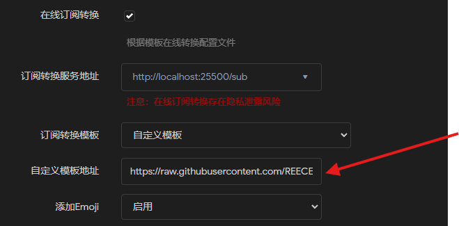
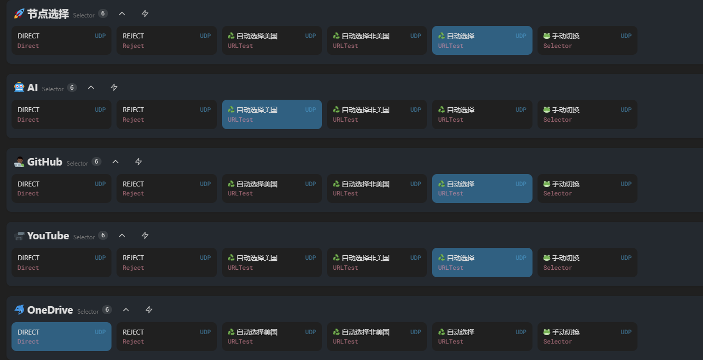

# OpenClash🐱规则

## 当前使用

download selforder.yaml 将里面的订阅链接修改为自己的机场，使用clash-party直接导入该yaml文件即可。

> 参考视频：
>
> [七尺宇Clash软路由的配置](https://www.youtube.com/watch?v=7wiu1YA8Pbc&amp;list=PLSbqX2QvapHk7VYlbyHUIOonIl7q1n410)
>
> 直接去看视频，这里写多了也是白写

## 应用背景

细细盘算一下我的上网有这几个需求：

* 国内的应用-微信，Bing国内版，bilibili
* 国外的应用-油管，得到拓展，开放的爱，克劳德女士，密斯艾薇儿

这其中微软的服务比较复杂：Bing，Copilot，MircoSoft需要走不通的规则。

当前我的魔法卷轴所有的章节的效果都差不多，所以我大致分为了三类：

1. 全部自动选择
2. 在美丽地区的自动选择
3. 在非美丽地区的自动选择

## 开始操作

在订阅配置中开启订阅转化，这样可以根据我自己的规则来分配魔法。

这时候需要手动输入两个：在线订阅转化地址，自定义模板地址。

**在线订阅转化地址：** 这里我是用的自己部署的Docker，如果不用自己的部署的化，可以使用原有的第一个就可以。`http://localhost:25500/sub`

**自定义模板地址：** 这里直接用了修改[七尺宇](https://www.qichiyu.com/)给的配置，并且放在了我自己的`得到拓展`​上面。

> 这里放一下[七尺宇老师的配置地址](https://qichiyu.blogspot.com/2024/07/openclash.html)

​​

结束！直接更新配置，可以手动重启一下OpenClash，订阅成功后就可以看见规则已经根据我的思路来了。

​​

## 尾巴

这个	`.ini`​文件的格式非常高！！！！建议全程复制粘贴，并且自定义的规则集与策略组要一模一样！！！不然无法加载！！！最后Bing的规则走的是Copilot，所以Bing要走直连的话直接把Copilot设置成直连就可以了。
**github的更新不一定立刻同步，需要点开raw链接，然后复制链接，然后在OpenClash中手动更新订阅。**
还有还有，这个规则是我自己的，不一定适合你，所以你可以根据自己的需求来修改这个规则，这个规则是我自己的，不一定适合你，所以你可以根据自己的需求来修改这个规则，这个规则是我自己的，不一定适合你，所以你可以根据自己的需求来修改这个规则，重要的事情说三遍。
